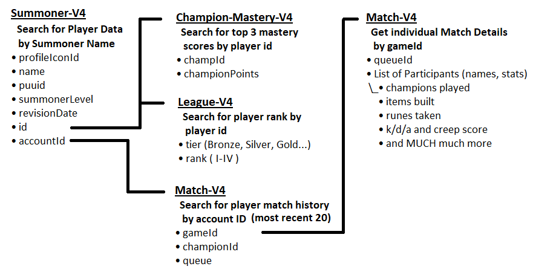

# League Profile
### Jordan Gerdin
##
## Brief Description:
The game League of Legends is an incredibly popular MOBA game with more than 100 million active players per month.
The game features over 140 unique champions to use across a multitude of gamemodes, typically built around a 5 vs. 5
match to destroy the enemy teams base.

There's a vast number of skills required to be the best of the best, and tracking stats is a good way to gauge overall 
performance. Riot, the company behind League of Legends has an incredibly in-depth API to retrieve these stats.

Here's a breakdown of the data flow for this project using Riots API:

# Requirements to run
In order to run this project, you'll need an API key from Riot. 

[You can create an account here](https://developer.riotgames.com/)

Save your API Key as an environment variable called "RIOT_API_KEY" and you should be all set.

Search for player accounts and make sure you select the proper region for the account. Some notable accounts of 
pro players that you can search:
* Doublelift (North America)
* C9 Sneaky (North America)
* Hide on bush (Korea)
  * AKA Faker, pro player for SKT T1
* Spencer Reid (Europe West) 
  * AKA Rekkles, pro player for Fnatic

# Known bugs/problems?
* Validation issues with older accounts
  * Accounts that haven't been active in a few years won't have Mastery scores or ranked info, and the GUI doesn't 
  account for this yet
* If the account has no ranked data, index out of bounds error happens. Currently checks player is ranked before 
displaying data, but modifying so that profile just displays "Unranked" would be better.
